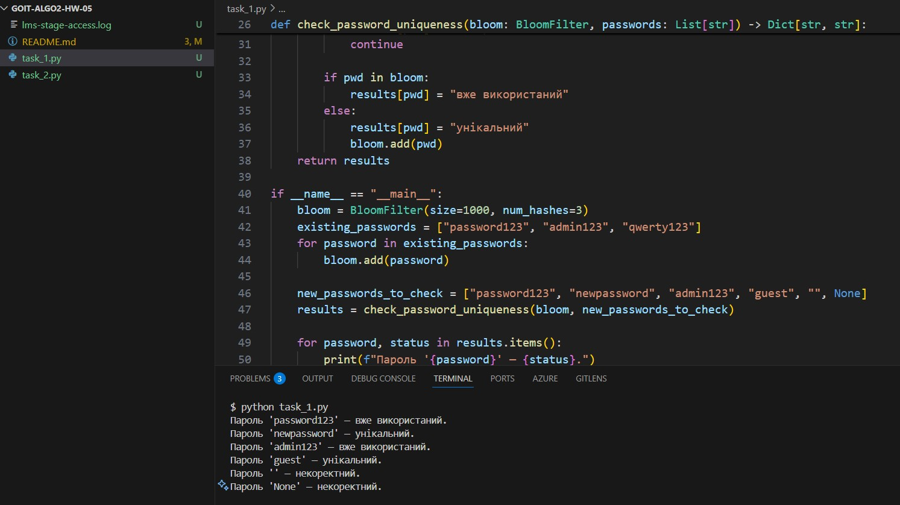
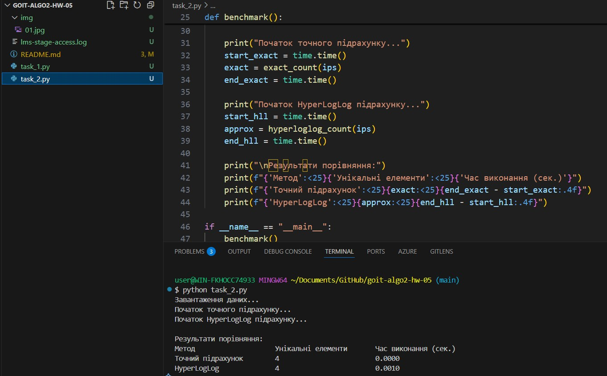

# goit-algo2-hw-05

# Домашнє завдання: Алгоритми роботи з великими даними

## Завдання 1: Перевірка унікальності паролів за допомогою фільтра Блума

### Опис

Реалізовано структуру даних `BloomFilter` для пам'яттєво-ефективної перевірки, чи використовувався пароль раніше. Функція `check_password_uniqueness` перевіряє список нових паролів на унікальність.

### Запуск

python task_1.py

Приклад результату

Пароль 'password123' — вже використаний.
Пароль 'newpassword' — унікальний.
Пароль 'admin123' — вже використаний.
Пароль 'guest' — унікальний.
Пароль '' — некоректний.
Пароль 'None' — некоректний.

### Результат

## Завдання 2: Порівняння HyperLogLog з точним підрахунком

Скрипт порівнює точний підрахунок унікальних IP-адрес через set та наближений підрахунок через HyperLogLog.

Вхідні дані
Файл логів: lms-stage-access.log (містить IP-адреси в кожному рядку).

Встановлення залежностей

pip install hyperloglog

### Запуск

python task_2.py

Приклад результату

Результати порівняння:
Метод Унікальні елементи Час виконання (сек.)
Точний підрахунок 4 0.0001
HyperLogLog 4 0.00010

### Результат

